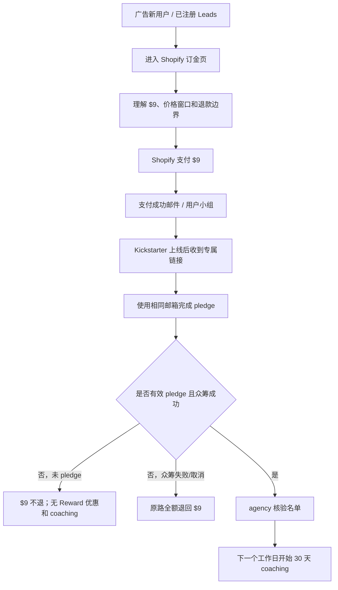

# LunaWake Shopify 订金页产品需求文档

> 版本：v2.1
> 状态：页面结构、Coach 权益口径与业务规则已确认；待接入 Shopify 商品 URL、支付订单属性和 agency 的 Kickstarter 配置
> 更新依据：前测报告、广告信任与数据采集笔记、agency 参考链路、当前 `deposit.html` 原型审计

## 1. 产品目标

页面 2 是 Shopify 独立商品页，直接收取 `$9` 订金，承接两类用户：

- 广告新用户：无需先注册 Leads，理解规则后可直接进入 Shopify 支付；
- 已注册 Leads：通过 EDM / Group 进入，不重复填写留资表单。

页面的核心目标是提高 `Leads → $9 支付完成率`。现有约 2,000 个 Leads 可作为首批转化人群；50% 是内部目标，不是对用户的承诺。点击率只做辅助指标，最终以 Shopify 成功订单为准。

## 2. 核心信任原则

### 2.1 先讲清楚，再讲卖点

86.9% 的前测用户没有众筹经验，页面必须用白话解释 Kickstarter：

> Shopify 现在收取 `$9`，Kickstarter 上线后再通过专属链接完成正式 pledge。两次支付不是同一笔订单。

首次出现 `pledge`、`Reward`、`Kickstarter` 时必须附带白话解释，不使用未解释的 backer、stretch goal 等行话。

### 2.2 退款规则首屏公开

支付前必须同时看到：

- Kickstarter 上线前，可联系人工客服申请 `$9` 原路全额退款；
- Kickstarter 上线后，如果没有完成 pledge，`$9` 不退款；
- 众筹失败或取消，`$9` 原路全额退款；
- 用户取消自己的 Kickstarter pledge，不触发新的 `$9` 退款流程。

主动披露“不利规则”是信任设计，不得只藏在 FAQ。

### 2.3 `$9` 的语义

营销叙述使用：

> `$9` locks your current launch-price eligibility.

支付与法律说明必须同时明确：

- `$9` 是 Shopify 订金，不是 Kickstarter pledge；
- `$9` 不直接抵扣 Kickstarter 支付；
- 专属优惠由 Kickstarter Reward / agency 专属入口配置；
- 订金邮箱和 Kickstarter pledge 邮箱必须一致。

### 2.4 只使用已确认的 wellness 表述

本轮不使用 PSG、临床级、诊断、治疗或临床效果承诺。隐私是信任证明，不占据主标题或主卖点位；页面可使用：

- No camera；
- No wearable；
- Raw signals stay on the device；
- Physical privacy gate；
- Wellness product, not a medical device。

## 3. 用户链路



## 4. 页面内容与顺序

页面固定采用“Hero → 退款规则 → 价格窗口 → 五色展示 → 三步流程 → Luna Coach → 产品证明 → FAQ → Final CTA”的订金决策顺序。页面只讲清楚产品是什么、为什么现在预订、预订后如何获得权益；完整产品介绍由 Header 的 `How it works` 链接承接至官网，不在订金页复制 Page 1 的完整叙事。

### 4.1 首屏与支付卡

首屏 5 秒内必须理解：

- LunaWake 是什么；
- 现在支付 `$9`；
- 当前可获得哪个 Kickstarter Reward 价格；
- 什么时候可以退款；
- 下一步要通过专属链接完成 pledge。

首屏主信息：

```text
Unlock $229.
For $9 today.

Save $150 vs. $379 retail

A contact-free bedside sleep system — no wearable, no camera.

[Reserve for $9]

Refundable before Kickstarter launches.
After launch, the $9 is non-refundable if you do not pledge.
```

商品卡必须保持紧凑，只包含：

- `Shopify reservation`；
- 当前 `$9` 与 Kickstarter Reward 价格；
- 当前价格窗口的动态剩余天数，例如 `20 days left at this price`；截止当天显示 `Ends today`；
- 一句上线前可退款的边界说明；
- 主 CTA 与安全预览状态。

首屏左右两栏不得重复完整流程。Hero 整体只承担产品结果、`$9 / 当前 Reward / $379` 价格关系、退款边界和 CTA；完整的 Shopify → Kickstarter → Coach 阶段说明只出现在三步流程中，四种退款与 pledge 结果只出现在规则区。

购买卡必须在桌面端首屏内完整呈现 `$9`、当前 Reward 价格和主 CTA。倒计时由当前窗口的 `endAt` 与 `timezone` 配置计算，不写死在页面文案中。

### 4.2 三档价格窗口

当前确认价格直接公开，且必须与 Kickstarter 实际 Reward 配置一致：

| 窗口 | Reward 价格 | 截止时间 | 相对 `$379` 零售价 |
|---|---:|---|---:|
| Founding Backer | `$229` | Aug 24 | Save `$150` |
| Super Early Bird | `$269` | Sep 7 | Save `$110` |
| Early Bird | `$319` | Sep 21 / launch day | Save `$60` |

要求：

- 当前窗口使用 `Lowest launch price` 主卡视觉突出；
- 后续窗口使用紧凑价格阶梯，不与当前价格同等抢注意力；
- 当前窗口优先显示 `Save $150 · X days left`；具体 `endAt` 未配置时回退为 `while this window is open`，不显示虚假倒计时；
- 后续窗口显示相对当前价格的涨幅，例如 `+$40 after current`、`+$90 after current`；
- 已结束显示 `Ended`，未开始显示 `Upcoming`；
- 日期、年份、时区、具体关闭时间、状态均配置化；
- 页面不展示 `$300–$400` 类目参考锚点；
- 页面不展示未经 agency 确认的库存上限；
- `$379` 仅在其确为公开上市零售价时展示；
- Reward 售罄时由 agency 执行升级或替代方案。

### 4.3 三步流程

1. **Pay $9 through Shopify**：订金锁定当时价格窗口；上线前可申请退款。
2. **Pledge on Kickstarter**：上线后收到专属链接，用相同邮箱完成 pledge；Kickstarter 是正式购买平台。
3. **Start 30-day coaching**：agency 核验有效 pledge 且众筹成功后，下一个工作日开始 Day 1，不等待发货。

退款、未 pledge、取消 pledge 和众筹失败的结果统一放入独立的 `Your $9, in plain English` 规则表，不在三步流程旁重复展示。

第二步的上线日期必须复用 `priceWindows` 中 launch-day 窗口的 `displayDeadline`，不得在 HTML 或另一套配置中维护第二个日期来源。

### 4.4 Luna Coach 权益模块

该模块位于 `How the reservation works` 三步流程之后、产品证明之前。它不是独立购买入口，也不是泛泛的 AI 聊天或产品介绍，而是把众筹成功后用户实际获得的 Coach 交付讲具体，回答“为什么值得完成后续 pledge”。

内容依据：`luna-product/docs/context/luna-coach-positioning.md`、`Lunawake-wiki/data-analysis/report-08-04/deposit-page-requirements-v1.4.md` 与 `Lunawake-wiki/data-analysis/reports/cross-insights.md`。这些材料共同指向“从看见数据到采取一个行动”的价值，而不是增加一个数据面板或聊天入口。

#### 商业口径

页面固定展示：

- `30 days of Luna Coach included`；
- `$19.99 value`，表示 30 天 Coach 的价值，不是当前 `$9` 订金金额；
- 仅在有效 Kickstarter pledge 且众筹成功后开启；
- `$9` 不直接购买 Coach，订金页不展示月度自动续费、`auto-renews monthly` 或 `cancel anytime` 等订阅文案。

#### 用户价值叙事

核心承诺是：

> See what stood out. Choose one thing. Keep adjusting as real nights change.

页面使用以下结构：

标题：`The part after the data.`

副标题：`30 days of Luna Coach · included — $19.99 value`

正文：`Luna turns your real nights into one clear place to begin, then keeps adjusting as life and sleep change.`

三个连续价值：

1. **Read**：Morning read 告诉用户昨晚发生了什么，不只给一个分数；
2. **Focus**：结合 Sleep Pattern 与用户表达的困扰，确定当前一个重点；
3. **Adjust**：通过每日行动、每周回顾和 Day 30 recap，让计划随真实夜晚调整。

服务节奏必须可扫读：

```text
Day 1 plan → Daily reads & actions → Weekly reviews → Day 30 recap
```

权益条件单独显示：

> Available after a valid Kickstarter pledge and campaign success.

模块底部保留 wellness 边界：

> Luna offers general sleep guidance. It does not diagnose or replace medical care.

#### 界面素材与布局

只使用两个能直接证明 Coach 交付的 App 界面：

- `images/app-screens/sunrise.webp` 作为主视觉，证明“昨晚发生了什么 + 今天可以做什么”，配文 `A clear read. One useful next step.`；
- `images/app-screens/sleep-pattern.webp` 作为次视觉，证明多晚数据可以整理成可理解的模式，配文 `Your nights begin to have a shape.`。

不在 Coach 模块使用 `wind-down.png` 或 `sensors-data.png` 作为主证据；它们属于设备控制、传感器与隐私说明，会把订金页带回完整产品介绍。桌面端采用左侧价值文案与服务节奏、右侧叠放两张截图；移动端先显示 Sunrise，再显示 Read / Focus / Adjust 和 Sleep Pattern。截图必须保持比例，不产生横向溢出。

该模块不新增任何购买 CTA。官方完整产品介绍通过 Header 的 `How it works` 链接跳转至 `https://lunawake.ai/#how-it-works`。

### 4.5 产品证明

只保留三个高价值主卖点：

1. **Read your night**：把夜间模式变成用户能理解的反馈；
2. **Adjusts for you**：灯光、声音和房间提示自动配合，不要求用户半夜操作；
3. **No wearable**：不需要佩戴戒指、手表或身体传感器。

隐私内容降级为信任行：`No camera / Raw signals stay on the device / Physical privacy gate`。

产品证明区使用桌面双栏、移动端单栏：左侧展示 `02-contact-free-sensing.mp4`，右侧展示三个卖点；视频必须带静态 poster、原生控制、`muted`、`loop`、`playsinline` 与 `preload="none"`。MP4 只有在视频进入视口附近时才写入 `src` 并下载；用户开启 reduced motion 时不自动播放。

页面不复制 Page 1 的完整产品故事。广告素材也必须保持单一主卖点：洞察类、自动调节类、免佩戴类、氛围类分别使用独立 `utm_content`，不能一条素材混讲多个主轴。

### 4.6 颜色展示与偏好

颜色尚未最终定案，但颜色本身是重要的消费刺激和产品偏好信号。因此页面展示完整的五色概念阵列：

- Dawn；
- Moonstone；
- Midnight；
- Amber；
- Sage。

本轮颜色展示是价格模块之后的独立视觉与偏好收集模块，不是支付前 SKU 选择器：

- 五色一起呈现，帮助用户想象产品进入卧室后的效果；
- 不默认选中任何颜色；
- 不阻塞 `$9` 支付；
- 不向 Shopify 透传默认颜色或锁定 SKU；
- 不阻挡、不延迟或要求用户先完成颜色选择再支付；
- 支付后通过邮件或运营流程确认最终颜色偏好；
- 产品层另行确认哪些颜色正式上市，页面不得承诺全部五色最终可售。

页面文案：

> Five finishes to make it yours. Finish preference will be confirmed after reserving. Your `$9` payment does not lock a color or SKU.

## 5. 页面视觉要求

订金页必须是主官网的延伸，而不是独立电商模板：

- 继承官网暖黑、米白、金色、深棕和蓝色辅助色；
- 使用官网的大号衬线标题、斜体强调和编辑式分栏；
- Header 使用半透明固定层，桌面端持续显示简洁 CTA；
- CTA 使用圆角胶囊按钮。无真实 Shopify URL 时所有按钮禁用并显示 `Launch`；URL 存在且 `reservation_open` 时，Header/移动端显示 `Reserve $9`，正文 CTA 可显示 `Lock in $229 access — $9`；
- 移动端固定 CTA 左侧显示 `$9` 和当前 Reward，按钮避免窄屏换行；
- `How the reservation works` 使用三节点时间轴：Now / Kickstarter goes live / After a successful campaign；
- 时间轴只承担阶段和动作提示；退款、Reward 资格和 coaching 条件由下方白色规则区完整解释，避免重复叙述；
- 减少矩形卡片、重阴影和密集表单感；
- 商品图片优先呈现卧室场景和产品关系，不只展示孤立的设备局部；
- 移动端固定 CTA 同时显示 `$9` 和当前 Reward 价格；
- 页面保持退款边界可见，但避免完整规则在多个位置重复出现。

## 6. 数据、归因与实验

### 6.1 UTM 与订单属性

页面读取并透传：

- `source`；
- `utm_source`；
- `utm_medium`；
- `utm_campaign`；
- `utm_content`；
- `utm_term`；
- `angle`；
- `creative`；
- `placement`。

跳转 Shopify 时追加：

- 上述来源参数；
- `price_window`；
- `reward_price`。

Shopify 侧必须通过 Cart Attributes、订单属性或 Shopify Flow 保存这些字段；仅拼接 URL 不算归因闭环。颜色未选择，因此本轮不写入 `finish`。

### 6.2 事件与指标

页面事件：

- `deposit_cta_view`；
- `deposit_cta_slot_view`，携带 `cta_slot`，每个 CTA 槽位只记录一次；
- `deposit_cta_click`；
- `deposit_cta_blocked`；
- `deposit_proof_view`，产品证据区首次有效曝光时记录；
- `deposit_proof_video_play`，视频首次实际播放时记录且只记录一次；
- `deposit_coach_view`，Coach 模块首次有效曝光时记录且只记录一次；
- `deposit_finish_select` 仅在未来重新开启颜色选择器后启用。

`deposit_coach_view` 沿用现有归因字段：`audience`、`utm_source`、`utm_medium`、`utm_campaign`、`utm_content`、`utm_term`、`angle`、`price_window`、`reward_price`，并额外记录：

- `section: 'coach_value'`；
- `coach_days`；
- `coach_value`。

Coach 模块只记录被动曝光，不新增 `deposit_cta_click` 或其他购买按钮事件。

支付完成以 Shopify 成功订单为准，不由页面伪造。核心周报指标：

- `$9` 支付完成率；
- 各素材 / 卖点角度的支付完成率；
- 已付 `$9` → 有效 pledge 率；
- 有效 pledge → coaching 激活率；
- 未 pledge 用户名单及客服触达结果。

高意向低预算用户通过页脚低调出口回到 Page 1 Leads 流程，出口必须带独立 UTM，不得与首屏支付 CTA 同权重。

FAQ 标题旁必须提供清晰的人工客服入口，直接展示当前客服邮箱（默认 `info@lunawake.ai`），点击后打开邮件；用于退款、邮箱不一致、专属链接补发、重复订金和入组异常。客服地址由 `supportUrl` 配置统一控制。

### 6.3 实验纪律

- 页面文案和价格窗口必须版本化并记录发布时间；
- 测试期间冻结同一版本，不用时间先后替代 A/B；
- 价格、退款措辞、卖点角度等变量随机分组；
- `utm_content` 必须对应单一素材主轴，后端按支付完成率判断素材去留。

## 7. 配置接口

```js
window.LUNAWAKE_DEPOSIT_CONFIG = {
  depositAmount: '$9',
  campaignState: 'reservation_open',
  pricingUnlocked: true,
  shopifyProductUrl: '',
  retailPrice: '$379',
  launchAt: '',
  priceWindows: [],
  finishes: {},
  coach: {
    includedDays: 30,
    value: '$19.99',
    availability: 'Available after a valid Kickstarter pledge and campaign success.'
  },
  supportUrl: 'mailto:info@lunawake.ai'
};
```

`deposit.html` 只是本地视觉与流程预览；生产支付由 Shopify 承载。没有真实 Shopify 商品 URL 时，页面不能进入投放，CTA 必须保持预览状态并明确提示。

## 8. 异常规则

| 场景 | 处理 |
|---|---|
| 上线前申请退款 | 人工核验 Shopify 订单，原路退 `$9`，订金资格失效 |
| 上线后未 pledge | `$9` 不退，不发 Reward 优惠和 coaching |
| Kickstarter pledge 取消 | 专属优惠失效，订金不退 |
| 众筹失败或取消 | 原路全额退 `$9` |
| 邮箱不一致 / Apple 隐藏邮箱 | 联系客服人工匹配，不能保证自动核验 |
| 重复支付 | 客服合并记录或按退款规则处理 |
| Reward 售罄 | agency 执行已确认的升级或替代方案 |
| 颜色未确定 | 不要求用户选择；支付后再收集偏好 |

## 9. 上线验收

- [ ] 首屏同时显示 `$9`、当前 Reward 价格、退款边界和下一步；
- [ ] 首屏以当前 Reward 价格为唯一主价格视觉；无 Shopify URL 时 CTA 禁用并显示 `Launch`；
- [ ] 购买卡显示当前价格窗口动态剩余天数，窗口截止当天显示 `Ends today`；
- [ ] 桌面端滚动时 Header CTA 持续可见，移动端固定 CTA 持续可见；
- [ ] 预约流程使用三节点时间轴，清楚区分 Shopify 支付、Kickstarter pledge 和 coaching；
- [ ] Coach 模块位于流程之后，明确 `30 days included`、`$19.99 value` 与“有效 pledge 且众筹成功后开启”；
- [ ] Coach 模块交付清楚呈现 `Day 1 plan → Daily reads & actions → Weekly reviews → Day 30 recap`；
- [ ] Coach 模块只使用 Sunrise 与 Sleep Pattern 两张 App 截图，桌面 / 移动端不变形、不横向溢出；
- [ ] Coach 模块没有额外支付 CTA，且订金页不出现月度自动续费相关文案；
- [ ] `deposit_coach_view` 只记录一次，并携带 Coach 配置字段与现有归因字段；
- [ ] 流程第二步的 launch day 来自 `priceWindows`，页面没有第二套日期来源；
- [ ] 首屏不存在两段以上重复解释 Shopify / Kickstarter 的长文案；
- [ ] `$229 / $269 / $319` 与 Kickstarter Reward 一致；
- [ ] 价格模块使用当前主卡 + 后续价格阶梯，而不是三个同等重量卡片；
- [ ] 页面不显示 `$300–$400` 类目锚点；
- [ ] 页面不使用 PSG / 临床 / 诊断 / 治疗承诺；
- [ ] 页面不要求用户选择颜色，且不透传默认颜色；
- [ ] 规则、卖点和视觉继承官网系统；
- [ ] 产品证据视频首屏不请求 MP4，接近视口后才加载；reduced motion 下不自动播放；
- [ ] 五色图优先加载 WebP，并保留同尺寸 PNG fallback；
- [ ] 新用户无需先注册 Leads，已注册 Leads 不重复留资；
- [ ] Shopify URL 配置后 CTA 可用，未配置时不会伪装成功支付；
- [ ] UTM、价格窗口和素材角度能落到 Shopify 订单属性；
- [ ] 页脚 Leads 出口带独立 UTM，且不抢首屏 CTA；
- [ ] 桌面端、移动端无横向溢出；
- [ ] 键盘焦点、语义结构、按钮状态和 FAQ 正常；
- [ ] FAQ 区域清晰展示人工客服邮箱，邮箱可点击并可由 `supportUrl` 配置替换；
- [ ] 控制台无错误，图片正常加载；
- [ ] CTA 槽位曝光、证据区曝光和视频首次播放事件不会重复记录；
- [ ] 记录版本号、发布时间和本轮实验变量。

## 10. 职责与阻塞项

### LunaWake / Shopify

- 提供真实 `$9` 商品 URL；
- 配置订单属性 / Cart Attributes / Shopify Flow；
- 执行人工退款和客服异常处理；
- 发送支付成功邮件和用户小组入口。

### Agency / Kickstarter

- 确认三档 Reward 价格、截止时间和时区；
- 提供专属链接、补发机制和 pledge 核验名单；
- 配置 Reward buffer、售罄升级方案和 campaign 状态；
- 确认 coaching 激活名单和交付方式。

### 当前阻塞项

- Shopify 商品 URL 尚未配置；
- Shopify 订单属性 / Flow 尚未验证；
- Kickstarter 专属链接和 Reward 配置尚未接入；
- 颜色方案尚未最终确定，因此本页面只展示五色概念阵列，不采集支付前 SKU 选择；偏好在支付后确认。
