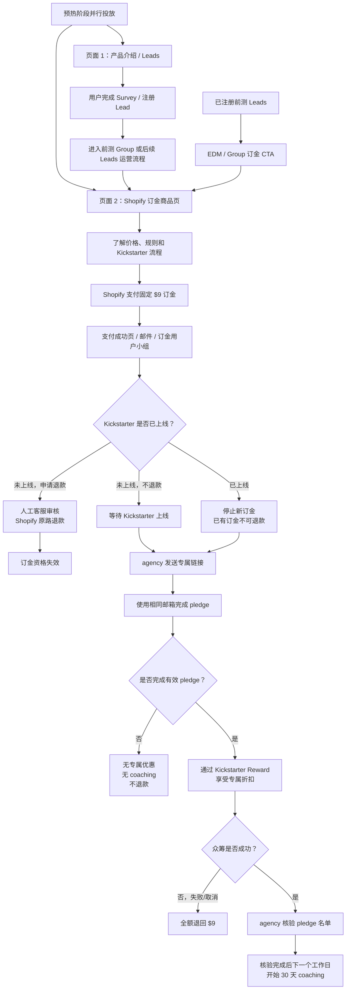

# LunaWake 订金转化链路产品需求文档

> 版本：v1.6
> 状态：页面结构已确认，待补齐最终价格、Shopify 商品配置、投放参数和 agency 执行配置

## 1. 目标与核心结论

预热阶段同时使用两个页面：

- **页面 1：产品介绍 / Leads 页面**，沿用前测流程，用于产品介绍、Survey 和 Lead 沉淀；
- **页面 2：Shopify 订金商品页**，作为可直接支付的订金转化页，用于广告投放和前测 Leads 的 EDM / Group 链路。

订金页不是自建 `deposit.html`，而是 Shopify 上的独立商品详情页和支付流程。

目标是让新广告用户可以直接完成订金决策，也让已经注册过的 Leads 跳过重复留资，直接进入 Shopify 订金页。

本轮转化目标：以现有约 2,000 个前测 Leads 为核心人群，目标推动约 50% 完成 $9 订金（约 1,000 笔）；行业 10% 仅作为外部参考基线，不作为页面承诺。页面优化和投放评估以 Leads → Shopify $9 支付完成率为核心指标。

## 2. 投放与用户链路

### 2.1 页面 1：产品介绍 / Leads 页面

页面 1 沿用前测页面和流程，不在本需求中重做产品介绍体系。

负责内容：

- 产品定位和完整产品卖点；
- 产品场景、能力和信任建设；
- Survey / 留邮箱 / Lead 注册；
- 前测 Group 或后续 Leads 运营承接；
- 引导已注册用户通过 EDM / Group 进入 Shopify 订金页。

### 2.2 页面 2：Shopify 订金商品页

页面 2 是独立的 Shopify 可支付页面，同时承接：

- 直接投放到订金页的广告新用户；
- 已注册 Leads 从 EDM / Group 进入的用户。

页面 2 不重复完整产品介绍，但必须让第一次直接进入的广告用户能够完成基本判断和支付。

## 3. 页面 2 的内容要求

### 3.1 首屏

首屏先呈现支付规则和用户下一步，再用后续模块补充产品介绍。用户在首屏需要快速理解：

- 这是 LunaWake 的 Kickstarter 订金；
- 现在支付固定 $9；
- 越早支付，后续 Kickstarter Reward 价格越低；
- 下一步会收到专属链接并完成 pledge。
- 首屏必须显式说明“上线前可全额退款”；同时在支付 CTA 附近说明 Kickstarter 上线后，如未完成 pledge，$9 不再退回。
- $9 的主叙述使用“锁定 Founding Backer / 当前价格窗口资格”，但法律和支付说明中仍明确它是 Shopify 订金。

主 CTA：`Reserve for $9` / `Pay $9 Deposit`。

页面 2 不设置与订金同等权重的 `Notify me` CTA；留资由页面 1 承担。为承接高意向但预算不足的广告用户，页面底部可保留低调的次级出口 `Not ready to reserve? Join the launch list`，不得与支付 CTA 争夺首屏层级。

页面信息顺序固定为：

1. `$9` 订金、退款边界、专属链接和同邮箱 pledge；
2. 三档价格窗口和零售价格锚点；
3. 三个关键时刻及 `$9` 的三种结果；
4. 精简产品卖点、隐私和 PSG 验证说明；
5. FAQ、客服和次级 Leads 出口。

这样页面 2 不要求 Leads 重新阅读完整产品故事后才能付款。

针对 EDM / Group / Leads 来源，页面需要显示“已在 launch list，无需重新留资”，并说明 Shopify 订单邮箱就是后续 Kickstarter 匹配邮箱。移动端需要保留固定的 `$9` 支付入口，避免用户在长页面中找不到 CTA。

### 3.2 最低限度产品说明

由于页面 2 会直接承接广告流量，至少保留：

- LunaWake 是什么产品；
- 无穿戴设备、无摄像头；
- 光线和声音根据睡眠节奏适配；
- 有效 pledge 且众筹成功后获得 30 天 coaching。
- 主卖点优先使用研究验证过的高价值表达：“读懂你的夜”和“它替你调节”；灯光、声音等机制作为支撑，不作为首屏唯一主叙事。
- 页面增加 PSG 相关验证说明，但在证据、法务确认前只能写成“正在进行/纳入验证的研究工作”，不得写成诊断、治疗或已完成的临床效果承诺。
- 30 天 coaching 显示具体参考价值 `$19.99 value`，并继续标注其生效条件。
- 无穿戴、无摄像头保留为信任证明，不占据首屏的主要卖点位置。

完整产品故事继续由页面 1 承担，页面 2 不复制页面 1 的四大功能模块和长篇叙事。

### 3.3 三档价格窗口

展示三档价格窗口：

1. Founding Backer：$229，Reserve by Aug 24；
2. Super Early Bird：$269，Reserve by Sep 7；
3. Early Bird：$319，Reserve by Sep 21 / launch day。

价格、日期、年份、时区、节省金额、当前状态和具体关闭时间全部配置化。

当前价格测试完成前，页面保留价格卡片和时间窗口，但金额显示为 `Price unlocking soon`，不公开未经确认的最终数字。价格解锁后再展示 Kickstarter Reward 的实际价格。

价格未解锁时必须提供价格锚点，避免用户把页面理解为 $100–150 的低价产品：

- 展示品类参考区间 `$300–$400`，并明确这是价格测试上下文，不是最终售价承诺；
- 展示配置化的上市后零售价锚点，当前参考为 `$379`；
- 价格解锁后展示 `Save $150 / $110 / $60 vs retail`，并且金额必须与 Kickstarter Reward 实际配置一致；
- 后续阶段支持按 UTM / 素材 / 卖点角度做有锚点与无锚点 A/B 测试，不能在同一实验中混用不同参考价。

要求：

- 当前档位必须突出显示；
- 已结束档位显示 ended；
- 未开始档位显示 upcoming；
- 价格解锁后的最终值必须与 Kickstarter Reward 实际配置一致；
- 不展示未经确认的硬性库存上限；
- Reward 售罄时执行 agency 已确认的升级或替代方案。

### 3.4 订金机制说明

页面必须明确区分：

- $9 是 Shopify 订金，不是 Kickstarter pledge；
- $9 不做 Shopify 与 Kickstarter 的跨平台金额抵扣；
- Kickstarter 专属优惠来自 Reward 或 agency 管理的众筹入口；
- 用户需要使用相同邮箱完成 pledge。
- 支付前必须重复说明：未完成 pledge 时，上线后 $9 不退，且不获得专属优惠或 coaching；这条规则不能只藏在 FAQ。

### 3.4.1 颜色偏好

- 颜色选择是可选偏好，不阻塞 $9 支付，也不作为 Shopify 必填变体；
- 默认展示 Stone，随后为 Charcoal、Amber；该顺序基于当前前测人群的主视觉适配，不改变可选颜色范围；
- 用户选择的 finish 作为偏好参数随 checkout 透传，后续仍可通过支付成功邮件确认最终颜色；
- 颜色偏好不代表已锁定库存或最终 SKU，不能在页面上承诺固定发货颜色。

### 3.5 三步流程

页面用三个连续时刻表达完整路径，用户无需阅读长 FAQ 才能知道下一步：

1. **Before Kickstarter — Lock eligibility**：在 Shopify 支付 $9，记录用户加入的价格窗口；上线前可申请全额退款；
2. **When Kickstarter launches — Pledge**：收到专属链接，用相同邮箱完成 pledge，获得对应 Kickstarter Reward 价格；
3. **After a successful campaign — Start coaching**：agency 核验有效 pledge 后，下一个工作日开始 30 天 coaching，不等待发货。

流程模块旁边必须同时呈现 `$9` 的三种结果：

- 上线前取消：原路全额退款；
- 众筹失败或取消：原路全额退款；
- 上线后未 pledge：$9 不退，不获得 Reward 专属优惠和 coaching。

订金商品卡还需要明确列出支付包含的内容：专属链接、价格窗口资格和满足条件后的 30 天 coaching；`$9` 由 Shopify 收取，可能按用户本地货币处理。

不能写成“众筹结束后一定退回 $9”或“发货后开始 coaching”。

### 3.6 支付成功后的用户小组

支付成功后需要提供订金用户后续承接方式，至少包含一种：

- Shopify 支付成功页提供入组入口；
- 支付成功邮件提供入组链接；
- 由运营人工将用户加入订金用户小组。

默认通过支付成功邮件发送入组链接；具体小组平台和自动化程度由运营确认，但必须能通过 Shopify 订单邮箱匹配用户。

### 3.7 FAQ / 规则提示

至少回答：

- 什么时候可以退款？
- Kickstarter 上线后还能退款吗？
- 如果没有完成 pledge 会怎样？
- 为什么必须使用相同邮箱？
- $9 是否直接抵扣 Kickstarter 价格？
- 众筹失败或取消怎么办？
- Coaching 什么时候开始？
- 支付成功后如何进入订金用户小组？
- `$300–$400` 和 `$379` 分别是什么价格锚点？

## 4. 已确认业务规则

| 项目 | 规则 |
|---|---|
| 订金金额 | 固定 $9 USD，通过 Shopify 支付；使用一个订金商品，不按价格档位拆商品。 |
| 价格档位 | 默认三档：Founding Backer $229、Super Early Bird $269、Early Bird $319。最终数字可配置，并在价格测试结束后确认。 |
| 价格窗口 | 默认沿用参考图：$229 截止 Aug 24；$269 截止 Sep 7；$319 截止 Sep 21 / Kickstarter launch day。年份、时区、具体关闭时间可调。 |
| Kickstarter 价格 | 订金用户的优惠直接配置在 Kickstarter Reward 或 agency 管理的众筹入口中；不做外部 $9 抵扣。 |
| 上线前退款 | 用户联系人工客服后申请；核验 Shopify 订单，通过原支付方式退回 $9；退款后订金资格失效。 |
| Kickstarter 上线后 | 停止收取新订金；已支付订金不再退款，用户直接使用专属优惠参与 Kickstarter。 |
| 未完成 pledge | 不享受专属折扣、不获得 coaching，且不产生新的退款流程。 |
| 取消 pledge | 专属优惠失效；订金不退。 |
| 众筹失败/取消 | 作为唯一项目异常例外，全额退回 $9。 |
| Reward 限额 | 页面不展示硬性名额上限；agency 预留可放大的库存 buffer，售罄时自动升级或提供替代方案。 |
| Coaching | 仅限有效 pledge 且众筹成功的用户；agency 核验完成后下一个工作日为 Day 1，共 30 天，不等待产品发货。 |
| 用户小组 | 默认通过支付成功邮件发送入组入口；平台和自动化方式待运营确认。 |
| 人工客服 | 预留客服入口，用于退款、邮箱不一致、重复订金、链接补发、入组和异常核验。 |

## 5. 页面状态

### A. 预热投放

- 页面 1 和页面 2 并行投放；
- 页面 1 负责 Leads 沉淀；
- 页面 2 直接承接广告并收取 Shopify $9 订金；
- 已注册 Leads 通过 EDM / Group 进入页面 2；
- 两条路径使用独立 UTM / source 标记，便于比较转化。

### B. 订金开放

- Shopify 订金商品可购买；
- 页面 2 展示三档价格和时间窗口；
- 展示上线前可退款、上线后不可退款规则；
- 支付成功后展示或发送订金用户小组入口；
- 记录订单邮箱、来源、价格档位和支付时间。
- 主要考核指标为 `$9` 支付完成率，不以 CTA 点击率作为最终转化指标。
- UTM 需要细化到 `source / medium / campaign / content / term`，并允许额外记录素材、卖点角度（如 `angle` / `creative`）；价格锚点 A/B 必须能在订单和分析事件中区分。

### C. Kickstarter 已上线

- 关闭新的 $9 订金商品或将商品切换为不可购买；
- 页面 2 提示已有订金用户检查邮件 / Group；
- agency 通过专属链接引导用户 pledge；
- 明确提示上线后订金不可退款。

### D. 众筹结束

- 成功：agency 核验有效 pledge，发送 coaching activation 邮件；
- 失败或取消：生成 $9 全额退款名单并执行原路退款；
- coaching 不依赖发货、签收或设备激活。

## 6. 数据与系统要求

### 6.1 页面 1 Leads 数据

- lead email；
- Survey / 表单完成状态；
- Group 状态；
- 来源和 UTM；
- 进入页面 2 的时间和链接来源。

### 6.2 Shopify 订单至少记录

- Shopify order ID；
- email；
- 订金金额（固定 $9）；
- order created time；
- 来源和 UTM；
- 当时命中的价格档位；
- finish（如 Shopify 商品需要记录）；
- 退款状态和退款时间；
- 订金用户小组入组状态；
- 客服备注或异常状态。

### 6.3 业务配置项

- `campaignState`：preheat / reservation_open / kickstarter_live / campaign_success / campaign_failed；
- 页面 1 和页面 2 的投放链接及 UTM 规则；
- `reservationEnabled`；
- `launchAt`；
- `priceWindows[]`：名称、价格、开始时间、结束时间、时区、状态；
- `retailPrice`：当前参考 `$379`；
- `priceAnchor`：当前参考 `$300–$400`，可按实验开关显示；
- 每个价格窗口的 `savings`，价格未解锁时不展示具体节省金额；
- Shopify $9 订金商品 URL；
- 支付成功页、邮件和用户小组入组规则；
- Kickstarter Reward / 专属链接发送规则；
- pledge 核验和 coaching 激活规则。
- 订金页面事件：`deposit_cta_view`、`deposit_cta_click`、`deposit_cta_blocked`；支付完成事件以 Shopify 订单为准，页面不得伪造支付成功。

### 6.4 不做的功能

- 不把 `deposit.html` 作为生产订金页；
- 不建立 LunaWake 用户账户系统；
- 不自建 Kickstarter 专属链接管理系统；
- 不做 Shopify 与 Kickstarter 的自动金额抵扣；
- 不做用户自助退款后台；
- 不把 coaching 绑定到发货或设备激活；
- 不在页面展示未经确认的最终价格或库存承诺。
- 不把 PSG 验证说明写成已完成的临床效果、诊断或治疗承诺，除非证据和法务已经确认。

## 7. 职责分工

### LunaWake

- 维护页面 1 的产品介绍和 Leads 流程；
- 管理页面 2 的 Shopify 订金商品内容和支付配置；
- 处理人工退款、入组和异常工单；
- 提供订金用户名单给 agency；
- 发送 coaching 激活邮件并负责 coaching 交付。

### Shopify

- 承载页面 2 的订金商品详情和 Checkout；
- 收取并记录 $9 订金；
- 保存邮箱、订单时间、来源和订单状态；
- 执行人工原路退款；
- 提供订单导出和退款状态。

### Agency / Kickstarter

- 确认三档 Reward 价格、时间窗口和有效期；
- 配置专属优惠 Reward；
- 发送、补发专属链接并匹配 pledge；
- 维护 Reward buffer 和售罄升级方案；
- 提供 pledge、项目成功、失败或取消状态；
- 确认 coaching 内容、领取方式和激活名单。

### 运营 / Leads 团队

- 维护页面 1 的 Survey、Lead 和 Group 流程；
- 维护 EDM 订金 CTA；
- 维护支付成功后的订金用户小组；
- 记录页面 1 → 页面 2 → Shopify 的转化数据。
- 按 `$9` 支付完成率、后续有效 pledge 率和 coaching 激活率评估素材与卖点，不只看点击率。

## 8. 上线前必须确认

- [ ] 页面 1 和页面 2 的投放链接、广告素材和 UTM 规则；
- [ ] 页面 1 的 Survey、Lead、Group 流程沿用前测版本；
- [ ] 前测 Leads 的 EDM / Group 是否直接链接页面 2；
- [ ] 页面 2 的 Shopify 商品详情、Checkout URL 和 $9 金额；
- [ ] 三档最终价格与 Kickstarter Reward 一致；
- [ ] Aug 24、Sep 7、Sep 21 的年份、时区和具体关闭时间；
- [ ] 价格测试完成时间，以及何时开始直接投放页面 2；
- [ ] 页面 2 的产品基础信息、价格、退款规则和 FAQ 文案；
- [ ] `$300–$400` 品类参考锚点和 `$379` 零售价锚点是否允许公开，以及有锚点 / 无锚点 A/B 的实验分流规则；
- [ ] PSG 验证说明的证据、法务审核和最终可用措辞；
- [ ] 相同邮箱、Apple 隐藏邮箱和邮箱不一致的处理；
- [ ] 支付成功邮件的入组链接和用户小组平台；
- [ ] Reward 数量 buffer、售罄升级或替代方案；
- [ ] 上线前退款、众筹失败/取消退款的人工流程；
- [ ] 未 pledge、取消 pledge、重复订金的处理方式；
- [ ] coaching 内容、激活邮件、领取链接和核验名单；
- [ ] Terms、FAQ、退款声明和 Kickstarter 风险提示完成审核。

## 9. 验收标准

- 页面 1 和页面 2 可以并行投放，且来源数据可区分；
- 页面 1 能完成产品介绍、Survey / Lead 注册和前测 Group 承接；
- 页面 2 是 Shopify 可支付订金页，可直接承接广告冷流量；
- 已注册 Leads 的 EDM / Group 能进入页面 2，不要求重复留资；
- EDM / Group / Leads 进入页面 2 后能看到无需重复留资的个性化提示，移动端始终有可见的 `$9` CTA；
- 页面 2 首屏能理解产品、三档价格、$9 订金和下一步 Kickstarter 流程；
- 页面首屏能理解“读懂你的夜 / 它替你调节”的核心价值，并看到上线前退款和上线后不退款规则；
- 价格未解锁时仍显示 `$300–$400` 参考锚点和 `$379` 零售价上下文，但不显示 `$229 / $269 / $319`；
- 价格解锁后可正确展示三档金额及对应节省金额；
- Shopify 只收取固定 $9，订单能记录邮箱、来源、档位和时间；
- UTM 可细分到素材和卖点角度，分析可归因到 `$9` 支付完成率；
- 支付成功后用户能看到或收到订金用户小组入口；
- 上线前人工退款成功后，订金资格失效；
- Kickstarter 上线后无法提交新的订金，已有订金不再退款；
- 用户必须使用相同邮箱完成 pledge，agency 能补发和匹配专属链接；
- 未 pledge 或取消 pledge 的用户不获得专属优惠和 coaching；
- 众筹失败或取消时能执行 $9 全额退款；
- 众筹成功且 pledge 核验完成后，下一个工作日开始 30 天 coaching；
- Reward 售罄时存在已确认的升级或替代方案；
- 桌面端、移动端、键盘操作、焦点状态和基础无障碍检查通过。
