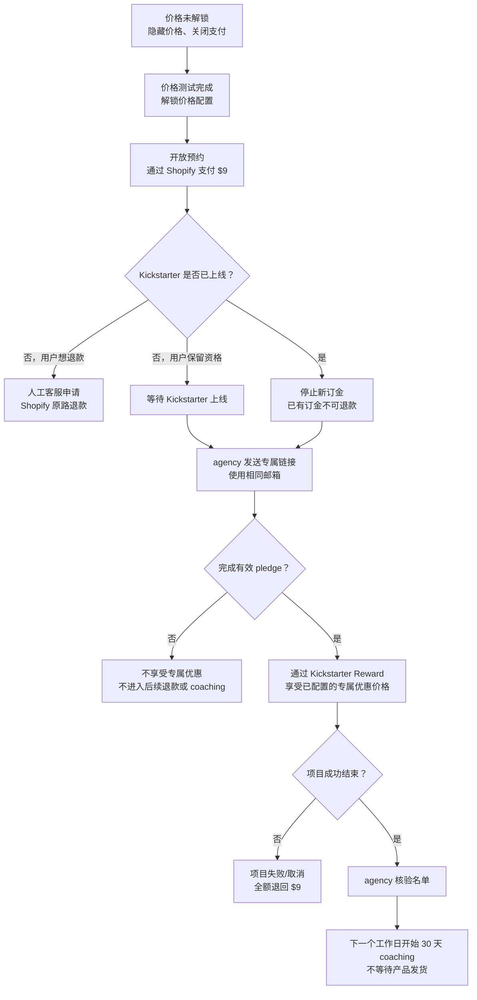

# LunaWake 订金页产品需求文档

> 版本：v1.0
>
> 状态：主站已恢复 Prelaunch CTA；订金页独立保留，待最终价格与支付配置确认后切换入口

## 一、产品目标

Kickstarter 上线前，用户通过官网支付 $9 订金，获得 Kickstarter 专属参与入口和优惠价格资格。

订金页的核心目标是承接早期用户，不在 Shopify 与 Kickstarter 之间做金额抵扣，也不设置众筹结束后的批量退款流程。

## 二、上线路径

- 当前主站及站内主 CTA 统一指向 `https://prelaunch.lunawake.ai/`，不链接订金页。
- `deposit.html` 作为独立订金页保留，后续确认价格、Reward 和 Shopify Checkout 后，可直接将主 CTA 切换至该页面。
- 不在主站增加“价格未解锁”的中间状态；切换订金页入口时，直接展示已确认的价格和预约流程。

## 三、最终用户流程

## 四、核心业务规则

| 项目 | 最终规则 |
|---|---|
| 价格解锁前 | 隐藏最终价格，关闭 $9 支付 CTA。 |
| 订金 | 一个固定 $9 Shopify 订金商品。 |
| 价格档位 | 默认沿用图中三档：$229 / $269 / $319；价格可配置，最终值在价格测试完成后解锁。 |
| 价格窗口 | 默认沿用 Aug 24、Sep 7、Sep 21 launch day；年份、时区、关闭时间可配置。 |
| 上线前退款 | 用户通过人工客服申请，Shopify 原路退款；退款后订单失去预约资格。 |
| Kickstarter 上线后 | 停止收取新订金；已有订金不可退款。 |
| 专属链接 | agency 负责发送、补发和 pledge 匹配；用户使用与 Shopify 订金相同的邮箱。 |
| 专属优惠 | 直接配置在 Kickstarter Reward 或 agency 管理的众筹入口中，不做外部 $9 抵扣。 |
| Reward 限额 | 订金用户不展示硬性限额；agency 预留可放大的库存 buffer，售罄时自动升级或提供替代方案。 |
| 用户未 pledge | 上线后不退款，也不享受专属优惠或 coaching。 |
| 用户取消 pledge | 专属优惠失效，不启动订金退款。 |
| 项目失败/取消 | 全额退回 $9。 |
| Coaching | 项目成功结束且 pledge 核验完成后，下一个工作日开始 30 天；不等待产品发货。 |

## 五、页面状态

### 1. 订金页未切换（当前主站状态）

- 主站 CTA 指向 Prelaunch；
- 订金页不出现在主站导航和主 CTA 中；
- 订金页保留为独立页面，等待最终配置后直接切换。

### 2. 预约开放

- 展示已解锁的价格档位和截止时间；
- 展示 $9 订金、上线前可退款、上线后不可退款；
- 开放 Shopify Checkout；
- 提醒用户填写可正常接收邮件的地址，并在 Kickstarter 使用相同邮箱。

### 3. Kickstarter 已上线

- 关闭新的 $9 订金支付；
- 明确提示已有订金用户检查邮件；
- 通过 agency 专属链接进入 Kickstarter；
- 明确上线后不再接受订金退款。

### 4. 众筹成功结束

- agency 核验有效 pledge 名单；
- LunaWake 发送 coaching activation 邮件；
- 用户从核验完成后的下一个工作日开始使用 30 天 coaching；
- 不等待产品发货或签收。

## 六、产品范围

### 本期包含

- 价格未解锁、预约开放、Kickstarter 已上线等页面状态；
- 一个 $9 Shopify 订金 Checkout；
- 预约时间对应的价格档位记录；
- 订金邮箱和订单信息记录；
- 退款规则、专属链接说明、相同邮箱提示；
- 30 天 coaching 权益说明和领取入口；
- finish 数据结构保留，但默认不公开。

### 本期不包含

- LunaWake 用户账户系统；
- 自建 Kickstarter 专属链接系统；
- Shopify 与 Kickstarter 的跨平台金额抵扣；
- 用户自助退款后台；
- 依赖物流签收或设备激活的 coaching 触发；
- 订金阶段公开 finish 选择。

## 七、三方职责

### LunaWake

- 维护订金页、价格配置和 Shopify 订金商品；
- 提供客服退款处理；
- 提供订金用户名单；
- 发送 coaching 领取邮件并负责 coaching 交付。

### Shopify

- 收取固定 $9 订金；
- 记录订单、邮箱和下单时间；
- 执行上线前人工原路退款；
- 提供订单导出和退款状态。

### agency / Kickstarter

- 配置最终 Reward 价格和优惠；
- 发送、补发和管理专属链接；
- 匹配 pledge、维护 Reward 库存 buffer；
- 执行售罄升级或替代方案；
- 提供项目成功、失败、取消和 pledge 状态。

## 八、上线前配置项

- [ ] 价格解锁日期和时间；
- [ ] 三档价格最终值；
- [ ] 三档窗口的年份、时区和关闭时间；
- [ ] Kickstarter Reward、优惠价格和有效期；
- [ ] Reward 预留数量、buffer 和售罄升级规则；
- [ ] agency 专属链接发送、补发和匹配方式；
- [ ] 项目失败/取消时的项目状态通知和全额退款名单；
- [ ] coaching activation 邮件、领取链接和服务范围；
- [ ] Shopify $9 订金商品、Checkout URL 和人工退款流程；
- [ ] Terms、FAQ、退款声明和众筹风险提示审核。

## 九、验收标准

- 当前主站 CTA 均指向 Prelaunch，订金页未被主站链接；
- 订金页切换上线后，最终价格和时间窗口来自可配置数据；
- 价格解锁后，页面显示的价格和时间窗口来自可配置数据；
- Shopify 只收取固定 $9；
- Kickstarter 上线后不能继续提交新的订金；
- 上线前退款、上线后不退款的规则表达一致；
- agency 专属链接、相同邮箱和 Kickstarter 优惠流程一致；
- Reward 售罄有预留、升级或替代方案；
- 项目失败/取消能执行 $9 全额退款；
- 项目成功结束且 pledge 核验完成后，下一个工作日可以发出 coaching 领取信息；
- 桌面端、移动端、键盘操作和基础无障碍检查通过。
